

  <h1>LunaBloom</h1>
  
<strong>A private, offline-first, highly performant women's health and cycle tracking application built for iOS and Android.</strong>

  

    
    
    
    
  

---

## 📱 Application Preview

### Seamless Light & Dark Mode Integration

|                             Welcome (Light)                              |                             Welcome (Dark)                              |                          Dashboard (Light)                          |                          Dashboard (Dark)                          |
| :----------------------------------------------------------------------: | :---------------------------------------------------------------------: | :-----------------------------------------------------------------: | :----------------------------------------------------------------: |
| 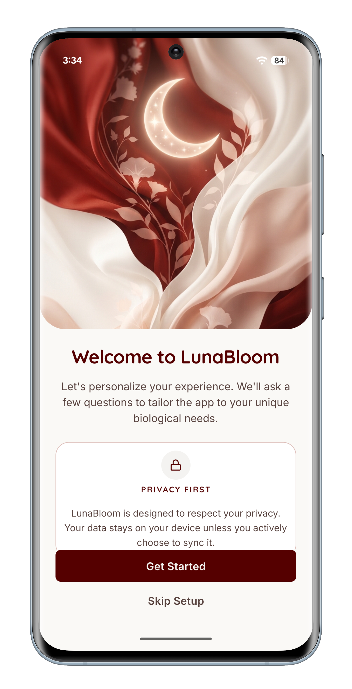 | 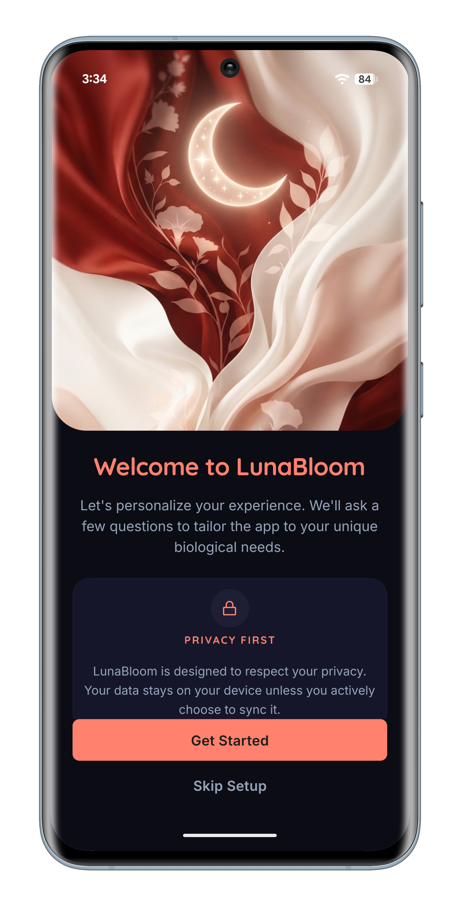 |   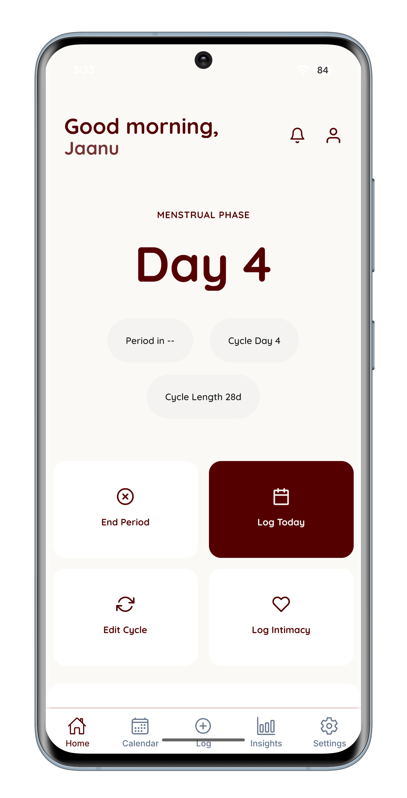   |   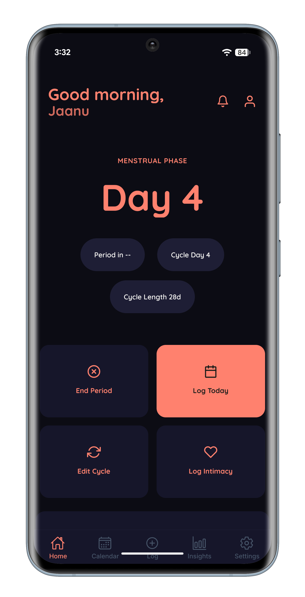   |
|                           **Calendar (Light)**                           |                           **Calendar (Dark)**                           |                        **Daily Log (Light)**                        |                        **Daily Log (Dark)**                        |
|   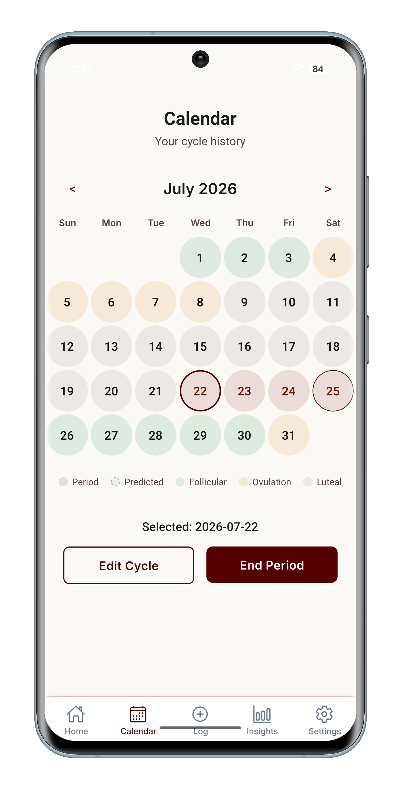    |   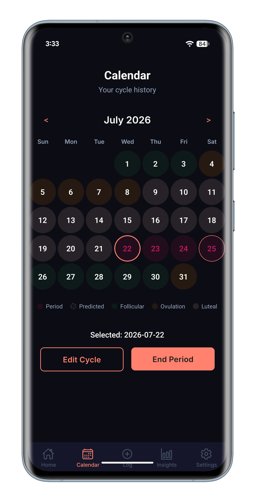    | 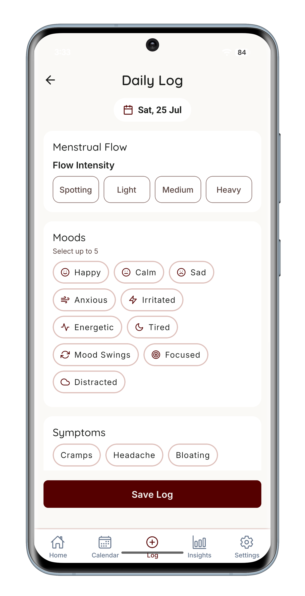 | 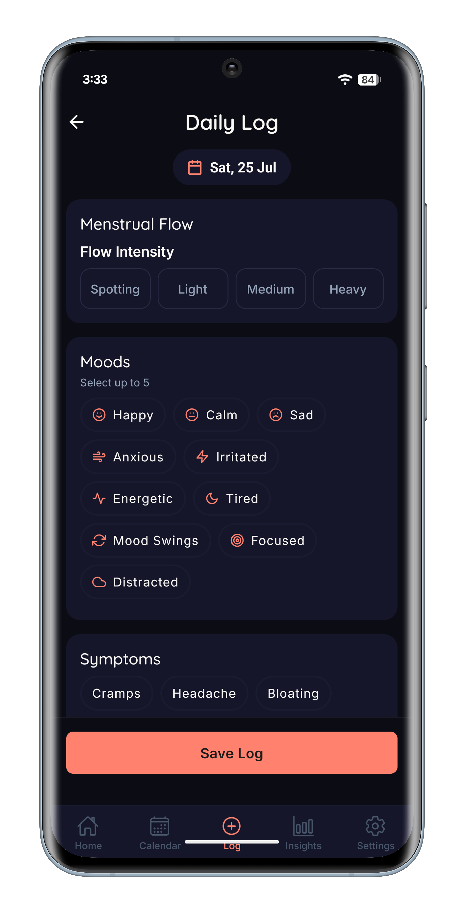 |
|                            **Learn (Light)**                             |                            **Learn (Dark)**                             |                        **Insights (Light)**                         |                                                                    |
|  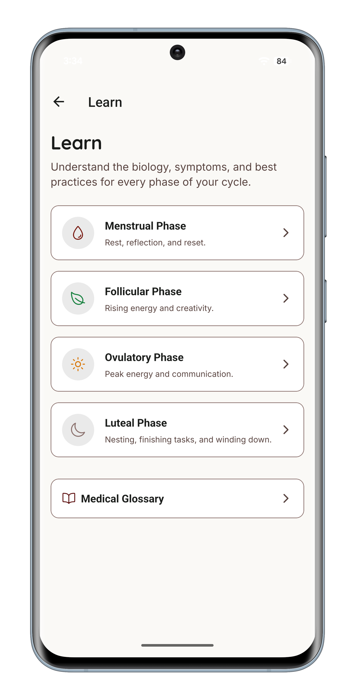  |  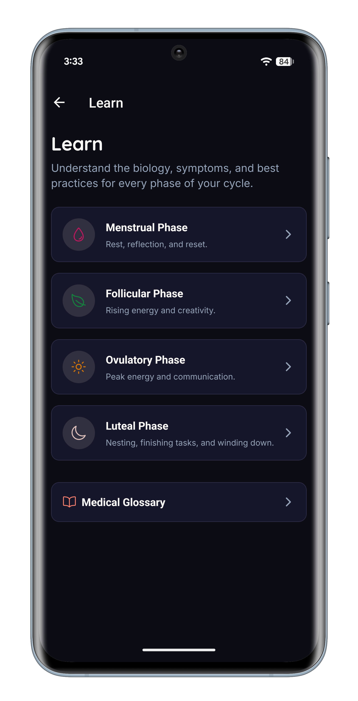  |    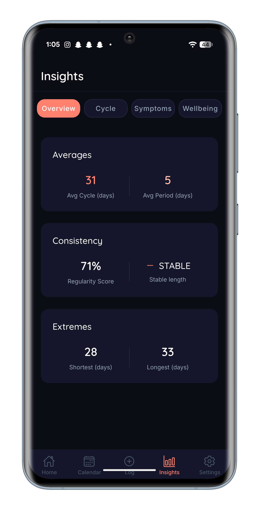    |                                                                    |

---

   
  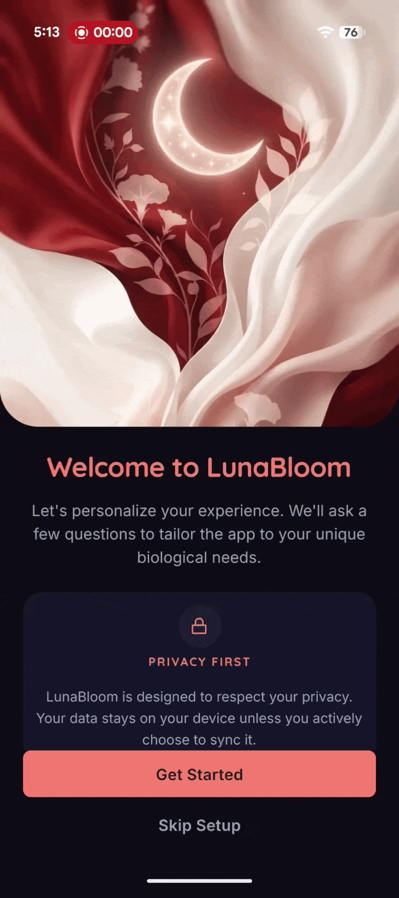
  &nbsp;&nbsp;
  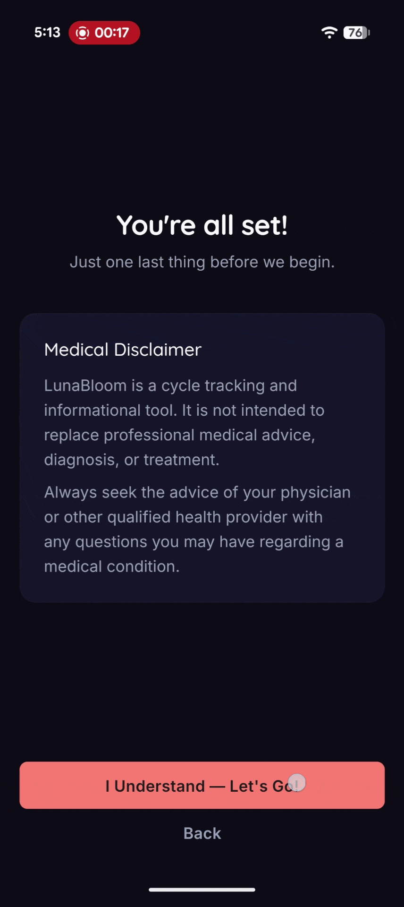
  &nbsp;&nbsp;
  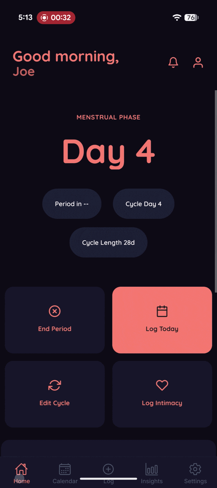
   

## 📖 Overview

LunaBloom is a mobile application designed for individuals seeking a deeply customizable, absolutely private, and highly performant approach to tracking reproductive health.

In a market saturated with centralized, cloud-dependent health trackers that monetize sensitive data, LunaBloom takes a radically different approach. It is engineered to be **offline-first**. All personal health information (PHI) remains encrypted and strictly localized on the user's device via SQLite.

### Why Offline-First?

Health data is uniquely personal. By eliminating cloud dependencies for the core tracking functionality, LunaBloom achieves three primary objectives:

1. **Uncompromising Privacy**: Without a centralized database, there is no risk of mass data breaches or non-consensual data brokering.
2. **Sub-millisecond Performance**: Local SQLite queries allow complex analytical insights (e.g., mapping symptoms across a multi-year cycle history) to render instantly without loading spinners.
3. **Absolute Reliability**: The application is 100% functional in low-connectivity environments, ensuring users can log data on flights, in remote areas, or on subways.

---

## ✨ Features

LunaBloom is structured around distinct feature modules that work together to provide a holistic view of the user's health.

### Cycle Tracking

At its core, LunaBloom provides algorithmically driven period and ovulation predictions. These predictions adapt dynamically based on historical cycle averages, variances, and specific user configurations. Users can exclude irregular cycles from the prediction algorithm to maintain accuracy.

### Calendar View

A comprehensive, visually distinct calendar interface that allows users to rapidly scrub through past months and view future predictions. It aggregates cycle phases, daily log indicators, and upcoming fertile windows into a single, highly scannable view.

### Intelligent Data Validation

LunaBloom employs a rigorous domain-level validation engine. It strictly prevents corrupt or impossible entries (such as overlapping periods or future dates) while dynamically adapting to the user's specific baseline. If a user logs biologically unusual data (like 1-day spotting or prolonged bleeding), the system warns them before saving, protecting data integrity without sacrificing UX.

### Daily Logging

Granular tracking capabilities allow users to log deeply specific data on any given day. This includes menstrual flow intensity, dozens of categorized symptoms, mood variations, energy levels, sleep quality, and bespoke physical indicators.

### Insights & Analytics

The application maps daily logs against cycle phases to generate local data visualizations. Users can identify distinct patterns over time—such as correlations between specific cycle days and sleep degradation—enabling them to take proactive measures regarding their health.

### Learn & Education

A dedicated section providing educational modules covering hormonal health, fertility awareness, and general wellness. This content is stored locally, allowing immediate access without requiring a network request.

### Privacy & Security

Beyond the offline-first architecture, LunaBloom offers application-level security features, including an immediate PIN lock screen and biometric authentication (FaceID/TouchID) before accessing the underlying database.

### System Settings

A robust settings interface that allows users to configure tracking goals (e.g., cycle tracking vs. fertility awareness), adjust cycle averages, manage notifications, and safely purge their local database if desired.

### Accessibility First

The UI is fully compatible with system-level font scaling (Dynamic Type) and is rigorously tested against VoiceOver and TalkBack to ensure navigation is logical and inclusive for all users.

---

## 🏗 Architecture

LunaBloom was architected from day one to scale gracefully. We strictly adhere to **Clean Architecture** principles. This enforces a separation of concerns that ensures our core domain logic remains entirely independent of our UI frameworks and database technologies.

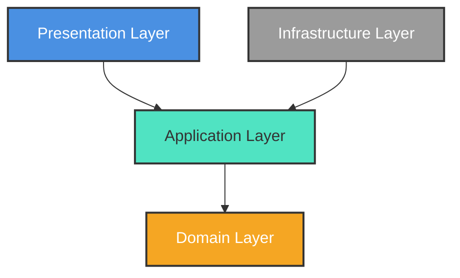

### 1. Presentation Layer

Contains React Native components, Expo Router definitions, and Zustand state management. The Presentation layer is "thin"—it only handles UI rendering and dispatches actions to the Application layer.

### 2. Application Layer

Contains application-specific business rules formulated as "Use Cases" (e.g., `LogSymptomUseCase`). This layer orchestrates data flow between the UI and the Domain, utilizing injected repository interfaces.

### 3. Domain Layer

The absolute core of the application. It contains the enterprise business rules, TypeScript models (`Cycle`, `DailyLog`), and abstract interface definitions for our repositories. It has zero external dependencies.

### 4. Infrastructure Layer

Handles everything external. It implements the interfaces defined in the Domain. This includes our concrete SQLite repositories, migrations, and local secure storage wrappers.

### Why Clean Architecture?

Mobile applications easily succumb to the "massive view controller" or "god store" anti-patterns, where API calls, database queries, and business logic are tangled inside React components. By enforcing Clean Architecture, we guarantee that our health prediction algorithms can be exhaustively unit-tested in a pure Node environment without spinning up complex simulators or mocking native iOS/Android modules.

---

## 🛠 Technology Stack

Every piece of technology in LunaBloom was selected through rigorous evaluation against our core requirements of performance, offline capability, and developer velocity.

### Frameworks & UI

- **React Native & Expo**: Selected for their unparalleled ability to maintain a single, highly performant codebase across iOS and Android. Expo's Continuous Native Generation (CNG) allows us to manage complex native dependencies without checking in `ios/` and `android/` folders.
- **Expo Router**: Chosen for its file-based routing mechanism. It drastically simplifies deep linking and nested tab navigation compared to traditional React Navigation setups.
- **Design Tokens**: Instead of using third-party UI libraries (like NativeBase or Tamagui), we implemented a bespoke, token-driven design system. This guarantees absolute control over our Light/Dark mode implementations and ensures the UI never feels bloated.

### State & Data

- **Zustand**: Selected over Redux for its minimalistic API and lack of boilerplate. Our stores act strictly as thin UI bindings, avoiding the anti-pattern of embedding business logic inside reducers.
- **SQLite (`expo-sqlite`)**: The backbone of our offline-first strategy. Selected over alternatives like AsyncStorage or MMKV because health data is highly relational. SQLite allows us to efficiently execute complex `JOIN` queries across years of daily logs.
- **Repository Pattern**: By abstracting SQLite behind a generic `Repository` interface, we decouple our business logic from SQL syntax.

### Quality Assurance

- **TypeScript**: Enforced strictly across all layers to prevent runtime errors and document our domain models.
- **Jest**: Used for pure unit testing of our Domain and Application layers.
- **Maestro**: Selected over Detox for end-to-end visual regression testing. Maestro’s YAML-based syntax is vastly easier to maintain and less flaky on CI servers.
- **ESLint**: Utilized aggressively, particularly with `eslint-plugin-react-native-a11y` to statically enforce accessibility standards during development.

---

## ⚙️ Installation & Development

LunaBloom is designed to be easily runnable on local machines.

For comprehensive instructions on setting up your environment, installing dependencies, and running the application locally, please refer to our **[Installation & Development Guide](docs/18_Installation_And_Development.md)**.

---

## 📚 Documentation Reference

We believe open source projects should be as well-documented as enterprise codebases. Please consult the following guides to understand the internal mechanics of LunaBloom.

| Document                                                                  | Description                                                                      |
| :------------------------------------------------------------------------ | :------------------------------------------------------------------------------- |
| **[Project Overview](docs/01_Project_Overview.md)**                       | High-level summary of the domain and offline-first requirement.                  |
| **[Engineering Case Study](docs/02_Case_Study.md)**                       | A deep dive into the technical challenges and decisions behind LunaBloom.        |
| **[Architecture Guide](docs/03_Architecture.md)**                         | Clean Architecture implementation details and Dependency Rule explanation.       |
| **[Folder Structure](docs/04_Folder_Structure.md)**                       | Detailed breakdown of the `src/` directory and its responsibilities.             |
| **[Design System](docs/05_Design_System.md)**                             | Token architecture, theme system, and typography guidelines.                     |
| **[Database Guide](docs/06_Database.md)**                                 | SQLite schema, migration strategy, and future syncing plans.                     |
| **[State Management](docs/08_State_Management.md)**                       | How Zustand interacts with Application Use Cases.                                |
| **[Development Setup](docs/09_Development_Setup.md)**                     | Exhaustive Expo, iOS, and Android environment configuration guide.               |
| **[Running the App](docs/11_Running_The_App.md)**                         | Differences between Expo Go, Development Builds, and Release Builds.             |
| **[Testing Guide](docs/12_Testing.md)**                                   | Jest unit testing and Maestro visual regression methodologies.                   |
| **[Release Process](docs/13_Release_Process.md)**                         | EAS build orchestration and store submission checklist.                          |
| **[Roadmap](docs/14_Roadmap.md)**                                         | Future plans for v2 Cloud Sync, notifications, and wearables.                    |
| **[Contributing](docs/15_Contributing.md)**                               | PR processes, coding standards, and branch naming conventions.                   |
| **[Troubleshooting](docs/16_Troubleshooting.md)**                         | Solutions for common Metro, Expo, and Node configuration issues.                 |
| **[FAQ](docs/17_FAQ.md)**                                                 | Developer frequently asked questions (Why SQLite? Why Clean Architecture?).      |
| **[Installation & Development](docs/18_Installation_And_Development.md)** | Single authoritative guide for setting up the project and beginning development. |

### 🧠 Architecture Decision Records (ADRs)

We document our major engineering decisions in the `docs/adr/` directory to provide context on **why** technical choices were made.

- [ADR-0001: Use Expo Router](docs/adr/0001-use-expo-router.md)
- [ADR-0002: Use Expo SQLite for Offline-First Data](docs/adr/0002-use-expo-sqlite.md)
- [ADR-0003: Use Zustand for Global State Management](docs/adr/0003-use-zustand.md)
- [ADR-0004: Implement the Repository Pattern](docs/adr/0004-repository-pattern.md)
- [ADR-0005: Offline-First Data Strategy](docs/adr/0005-offline-first.md)
- [ADR-0006: Clean Architecture Layering](docs/adr/0006-clean-architecture.md)

---

## 🚀 Engineering Highlights

LunaBloom is not just an application; it is a demonstration of mature engineering practices.

- **Offline-First Resilience**: Handling relational data without a server requires complex local synchronization state machines. The database schema inherently supports `sync_status` and tombstoning (`deleted_at`) to gracefully handle future conflict resolution scenarios when cloud synchronization is introduced.
- **Repository Abstraction**: The core application logic is fundamentally decoupled from the persistence layer. A developer could swap SQLite for Realm or WatermelonDB entirely within the `Infrastructure` layer without altering a single line of business logic in the `Domain` or `Application` layers.
- **Design System Migration**: The repository successfully navigated a migration from ad-hoc inline styling to a strict, scalable token system that natively handles operating-system-level dark mode toggles with zero rendering lag.
- **Predictive Engine**: Cycle prediction algorithms are abstracted into pure utility functions, allowing them to be run against thousands of mock historical permutations in Jest tests to ensure mathematical accuracy before deployment.

---

## 🗺 Roadmap

### Current Version (v1.0.0)

The application is fully functional offline, featuring the complete suite of Clean Architecture implementations, SQLite data persistence, and token-driven UI.

### Future Versions

- **Data Export**: Permitting users to extract their raw SQLite tables into interoperable CSV/JSON formats.
- **Rich Notifications**: Integrating local push notifications to prompt users for daily logging.
- **v2 Cloud Sync (Opt-In)**: Implementing end-to-end encrypted synchronization utilizing Firebase. This requires activating the latent `sync_status` machine within the SQLite layer.
- **Authentication**: Implementing secure auth strictly as a gateway for the cloud sync feature, ensuring the offline-first experience is never gated.

For more details, view the full [Roadmap](docs/14_Roadmap.md).

---

## 🤝 Contributing & Portfolio Status

This repository showcases engineering practices and serves as a portfolio project.

Because this repository accurately reflects the author's individual engineering capabilities, we are **not** accepting pull requests or external contributions.

If you spot a bug or have a feature suggestion, you are welcome to open an Issue for discussion. Please review our **[Contributing Guide](docs/15_Contributing.md)** before doing so.

---

## 📄 License

This project is licensed under the MIT License - see the [LICENSE](LICENSE) file for details.

> [!WARNING]
> **Portfolio Disclaimer**
> This repository is intended as a portfolio project. While the source code is MIT licensed, please do not republish the application or its branding as your own work.

  <i>Engineered with precision by Rithik Ramachandran</i>

