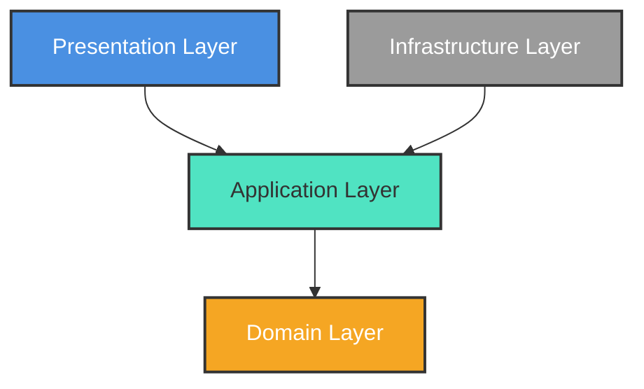

# Architecture Guide

LunaBloom is engineered using **Clean Architecture** principles. By strictly segregating the application into decoupled layers, we ensure that business rules remain independent of UI frameworks, databases, and external libraries.

## Architecture Overview

At a high level, the repository enforces a strict "Dependency Rule." Dependencies can only point *inward* toward the Domain layer. The inner layers know absolutely nothing about the outer layers.

For a detailed component-level view, see our [Architecture Diagram](./assets/architecture-diagram.md).

## Layer Responsibilities

### 1. Domain Layer (`src/domain/`)
The absolute core of the application. It contains enterprise-wide business rules.
- **Domain Models**: TypeScript interfaces representing the core entities (e.g., `Cycle`, `DailyLog`, `UserProfile`).
- **Interfaces**: Abstract definitions for repositories (e.g., `ICycleRepository`). This is how the Domain defines what it needs to fetch or save data without knowing *how* it happens.
- **Errors**: Standardized domain-specific error classes.

*Rule: The Domain Layer must not import from any other layer.*

### 2. Application Layer (`src/application/`)
Contains application-specific business rules. It orchestrates the flow of data to and from the Domain entities.
- **Use Cases**: Classes or functions that execute a specific user action (e.g., `LogSymptomUseCase`, `CalculateCyclePredictionsUseCase`).
- **Services**: Business logic that might span multiple entities but doesn't necessarily belong to a single Use Case.

*Rule: The Application Layer can only import from the Domain Layer.*

### 3. Presentation Layer (`src/presentation/`)
Responsible for all UI and state management. It maps data from the Application Layer into a format the UI can render, and maps user interactions back into Use Case executions.
- **UI Components**: React Native components and Expo Router screens.
- **State Management**: Zustand stores (e.g., `useCycleStore`) that act as thin wrappers. They invoke Application Use Cases and store the resulting Domain Models in memory for rapid UI rendering.
- **Hooks**: Custom React hooks bridging the UI and the stores.

*Rule: The Presentation Layer can import from Application and Domain layers.*

### 4. Infrastructure Layer (`src/infrastructure/`)
The outermost layer handling external concerns: databases, network requests, and device storage.
- **Repositories**: Concrete implementations of the interfaces defined in the Domain (e.g., `SQLiteCycleRepository` implementing `ICycleRepository`).
- **Database**: The local SQLite database, schemas, and migrations.
- **Storage**: Secure key-value stores (e.g., Expo Secure Store for PINs).

*Rule: The Infrastructure Layer implements Domain interfaces but is injected into the Application Layer.*

## The Repository Pattern & Dependency Injection

LunaBloom utilizes the **Repository Pattern** to abstract database operations. 
Because the Application Layer cannot depend on the Infrastructure Layer directly, we use **Dependency Injection**. 

When the application boots, a `RepositoryProvider` (acting as the Composition Root inside `app/providers/`) instantiates the concrete SQLite repositories from the Infrastructure layer and injects them into the Zustand stores. The stores then pass these interfaces into the Use Cases.

### Example Request Flow
See the detailed [Request Flow Diagram](./assets/flow-diagram.md) for a sequence mapping of how a user action traverses the layers down to SQLite and back up to the UI.

---
**Next up:** Explore the [Folder Structure](./04_Folder_Structure.md) to see how these layers map to directories, or read the [Database Guide](./06_Database.md) to understand the SQLite implementation.
