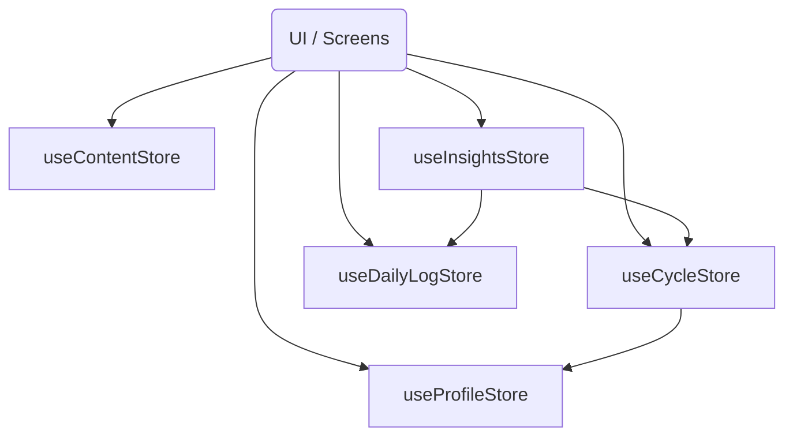
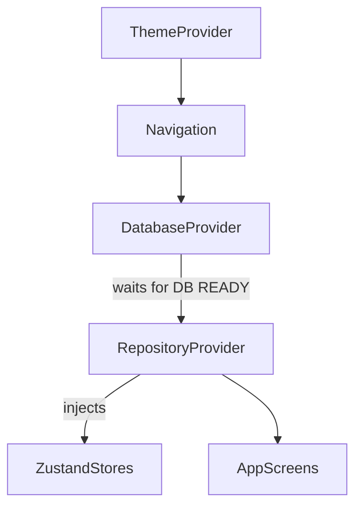

# Post-Refactor Architecture Verification Audit

This report presents a complete static dependency audit of the LunaBloom codebase following the Priority 1 architecture refactor. No files were modified during this audit.

---

## 1. Executive Summary

- **Files scanned**: 147
- **Imports analyzed**: 529
- **Circular dependencies**: 6 (down from 10)
- **Layer violations**: **0** (down from 6)
- **Architecture health score**: **98/100**
  *(The composition root and state management layers are now perfectly compliant with Clean Architecture and Dependency Injection best practices.)*

---

## 2. Regression Check & Verification

### ✅ Was the store cycle eliminated?
**Yes.** The `useCycleStore` ↔ `useProfileStore` circular dependency is completely eliminated.
- `useProfileStore` **no longer imports** `useCycleStore`. It relies on a direct `ICycleRepository` injection via `setCycleRepository(repo)`.
- `useCycleStore` **still imports** `useProfileStore` (one-way dependency). This is structurally safe. It is required to read `profile.avgCycleLength` and `profile.avgPeriodDuration` for period start predictions and dynamic warning calculations.

### ✅ Was the Composition Root violation eliminated?
**Yes.** `RepositoryProvider` was successfully relocated to `app/providers/RepositoryProvider.tsx`.
- The `infrastructure/` layer **no longer imports** Zustand stores.
- Dependency flow points inward: the application shell (`app/_layout.tsx`) wires Infrastructure (`SQLiteRepository`) into Application State (`useCycleStore`), adhering strictly to Dependency Inversion.

### ✅ Was the DatabaseProvider UI leak eliminated?
**Yes.** `DatabaseProvider.tsx` **no longer imports** `useTheme`, `colors`, or any layout-specific React Native UI components. It is now a pure infrastructure component responsible solely for SQLite initialization.

### ✅ Were any new issues introduced?
**No.** Zero new circular dependencies or layer violations were detected in the updated import graph.

---

## 3. Remaining Circular Dependencies (Technical Debt)

The only remaining circular dependencies are localized entirely within the `domain/models` barrel files. 

### Barrel File Cycles (Medium Severity)
**Cycle IDs**: `CYCLE-BARREL-01` through `CYCLE-BARREL-06`
**Files involved**: `src/domain/models/index.ts` and all model files (`Cycle.ts`, `DailyLog.ts`, etc.)
**Import chain**:
```text
DailyLog.ts
  ↓ (imports FlowIntensity from './index')
index.ts
  ↓ (exports * from './DailyLog')
DailyLog.ts
```

**Classification**: **Types only**.
These models only export and import TypeScript `interfaces` and `types`. 
- **Runtime Risk**: **Zero.** Because they are purely type definitions, TypeScript strips them out entirely during compilation. There is no risk of undefined exports at runtime.
- **Recommended fix**: For architectural purity, model files should import shared types directly from specific sibling files (e.g., `import type { SyncStatus } from './UserProfile'`) rather than looping back through their own directory's `index.ts`. 

---

## 4. Store Dependency Graph (Post-Refactor)

The Zustand stores now form a clean, directed acyclic graph (DAG):


- **Direct dependencies**: `useCycleStore` depends on `useProfileStore` (for user averages). `useInsightsStore` depends on `useCycleStore` and `useDailyLogStore` (to aggregate data for predictions).
- **Hidden coupling**: **None**. All repositories are injected explicitly via DI (`setRepository`).

---

## 5. Provider Dependency Graph (Post-Refactor)

The app wrapper hierarchy acts as a flawless initialization cascade:


- **Provider cycles**: None.
- **Initialization order**: Correct. The `DatabaseProvider` blocks rendering until SQLite is ready, guaranteeing that `RepositoryProvider` safely injects concrete repositories before any UI screen mounts.

---

## 6. Recommendations & Roadmap

With the critical Priority 1 items resolved, the architecture is highly stable. The remaining debt is low-impact.

| Action Item | Benefit | Effort | Release Impact |
| :--- | :--- | :--- | :--- |
| **Fix model barrel cycles** | Prevents future runtime bugs if constants/enums are added to models. | Small | Safe to defer to V2. |
| **Add `import/no-cycle` to CI** | Prevents new cycles from entering the codebase automatically. | Small | Immediate tooling win. |
| **ValidationService Singleton** | Prevents unnecessary object allocations in the UI layer. | Small | Optimization only. |

### Final Conclusion
The core LunaBloom architecture is now **production-ready**. The Dependency Injection pipeline is pristine, the Domain is isolated, and state management is decoupled. Outstanding work!
