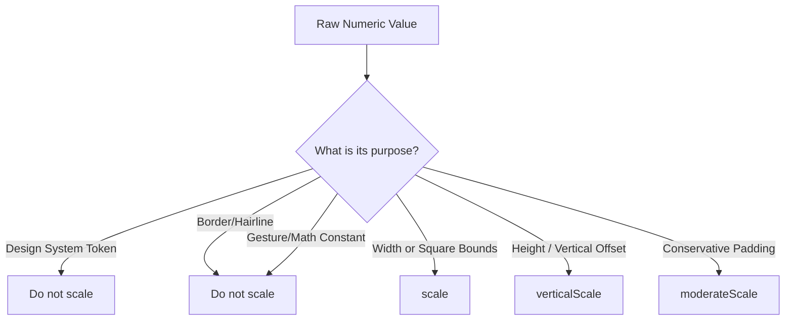
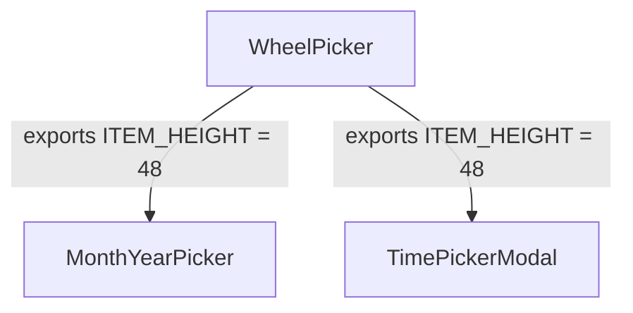

# Responsive Scaling Architecture

**Status:** Implementation Complete  
**Version:** 1.0.0  
**Domain:** Presentation Layer UI  

This document serves as the canonical technical reference for the Responsive Scaling feature in LunaBloom. It covers the mathematical foundation, the implementation architecture, the component migration strategies, and developer maintenance rules.

---

## 1. Overview
The Responsive Scaling utility provides a deterministic, mathematically sound way to scale UI geometry across devices of varying sizes, ensuring that the application looks proportionate on tiny phones, massive tablets, and everything in between.

## 2. Goals and Non-Goals

**Goals:**
- Maintain perfect visual consistency with the Pixel 10 baseline design on standard devices.
- Scale layout bounds, widths, and structural containers up and down proportionally.
- Clamp interactive elements to accessibility minimums so small devices remain usable.
- Limit max up-scaling so large tablets do not receive comically large UI elements.

**Non-Goals:**
- **Do not blindly scale design system tokens.** `spacing.md` remains `24pt`. Responsive scaling is *additive* to the design system, not a replacement for it.
- **Do not automatically scale typography.** Font sizes follow standard accessibility OS-level multipliers, not our raw mathematical scaler, to prevent text wrapping regressions.
- **Do not alter business logic or shared layout contracts.** 

## 3. Design Philosophy
Responsive scaling is **Selective Geometry Adaptation**. It bridges the gap between:
- **Design Tokens:** Canonical design values that assert brand identity (e.g., brand colors, spacing rhythms).
- **Responsive Geometry:** Structural values that govern layout boxes, container bounds, and widget proportions on differing viewports.

---

## 4. Baseline Device / Coordinate Model
The single source of truth for the design coordinate model is the **Pixel 10** in portrait mode.

- **`BASE_WIDTH` = 412**
- **`BASE_HEIGHT` = 917**

If a device evaluates to exactly 412x917, all scale multipliers evaluate precisely to `1.0`. The baseline invariant guarantees that the original design intent is mathematically perfectly preserved on target devices.

---

## 5. Scaling Mathematics

The module `src/design-system/scaling.ts` handles all math. It ensures that standard, extreme, and invalid device dimensions are managed safely.

### 6. Horizontal Scaling (`scale`)
Used to scale widths, margins, and square boundaries.
```typescript
hScale = Math.min(portrait_width / BASE_WIDTH, SCALE_CAP)
```
- Example on Pixel 10 (412w): `412 / 412 = 1.0x`
- Example on iPhone SE (320w): `320 / 412 ≈ 0.77x`

### 7. Vertical Scaling (`verticalScale`)
Used strictly to scale heights and vertical offsets where proportional stretch is desired.
```typescript
vScale = portrait_height / BASE_HEIGHT
```
- Intentionally **uncapped**. Because the app scrolls vertically, very tall devices simply receive proportionally taller containers without breaking the layout.

### 8. Moderate Scaling (`moderateScale`)
Blends the difference between the baseline size and the fully horizontally scaled size.
```typescript
clampedFactor = Math.min(1, Math.max(0, factor)) // Default 0.5
return size + (scale(size) - size) * clampedFactor
```
Use this for paddings or layout geometries that should scale *conservatively* (i.e. you want it to shrink on small phones, but not by the full 23% horizontal ratio).

### 9. Scale Cap
**`SCALE_CAP = 1.2`**  
The horizontal scale factor is hard-capped at 1.2x. A 1000px wide tablet will not render a button 2.5x larger; it will stop at 1.2x, utilizing the remaining whitespace elegantly instead of creating distorted giant UI elements.

### 10. Invalid Dimension Handling
If React Native's `useWindowDimensions()` transiently returns `0`, `NaN`, or negative numbers, the pure math layer fails safely by bypassing the calculation and falling back to exactly `1.0`.

### 11. Orientation-Lock Invariant
The app is natively portrait-locked. However, to guarantee absolute mathematical robustness in testing environments or split-screen foldables, the dimensions are normalized before scaling:
```typescript
portraitW = Math.min(width, height)
portraitH = Math.max(width, height)
```
This guarantees that rotating a device from 412x917 to 917x412 yields the exact same scaling multipliers.

---

## 12. Public API Reference

### 13. Reactive API — `useScaling()`
**Rule:** Use inside React components only.
```tsx
import { useScaling } from '@/design-system';

export const MyComponent = () => {
  const { scale, verticalScale } = useScaling();
  return <View style={{ width: scale(200) }} />
};
```
This is the standard consumption method. It utilizes `useWindowDimensions()` and `useMemo` to ensure UI perfectly reacts to foldables opening/closing or split-screen events.

### 14. Pure APIs
**`computeScaleFactors(width, height)`**
Pure function used under the hood. Fully testable in Jest without mocking.

**`createStaticScaleFactors()`**
A one-time snapshot of the current window dimensions.
**Rule:** Use this ONLY inside module-level constants or static `StyleSheet.create()` blocks that cannot accept React hooks. Note that it will *not* react to device dimension changes dynamically.

### 15. ScaleFactors Type
```typescript
export type ScaleFactors = {
  scale: (size: number) => number;
  verticalScale: (size: number) => number;
  moderateScale: (size: number, factor?: number) => number;
}
```

---

## 16. Design Tokens vs Responsive Scaling
**Do not wrap design tokens in `scale()`.**
```tsx
// ❌ WRONG - Do not scale design system tokens
<View style={{ gap: scale(spacing.md) }} />

// ✅ CORRECT - Trust the design system
<View style={{ gap: spacing.md }} />
```
Static design tokens (like `spacing.md = 24`) remain canonical. They enforce a consistent grid rhythm across the app. If a design token needs to be responsive in the future, that math will be implemented *inside the design system token registry*, not mutated at the component consumption layer.

---

## 17. Choosing `scale()` vs `verticalScale()` vs `moderateScale()`



---

## 18. Accessibility and Minimum Touch Targets
Never let scaling shrink interactive elements below OS minimums. Always clamp to a touch-target floor.
```tsx
// Ensures the button scales down, but NEVER drops below 48dp on tiny phones.
const buttonSize = Math.max(48, scale(56)); 
```

## 19. Border, Radius, Shadow and Structural Rules
**Never scale structural geometry.**
- `borderWidth: 1` ➔ Stays `1`. Scaling this causes fuzzy sub-pixel rendering.
- `shadowOffset: { width: 0, height: 4 }` ➔ Stays static.
- `borderRadius: 999` ➔ Stays static for pill shapes. (For dynamic circles, use `buttonSize / 2`).

## 20. Fixed Values and Intentional Non-Scaling
You will find many unscaled raw numbers in `StyleSheet.create` blocks (e.g. `1`, `2`, `4`, `8`). These are intentional fixed values governing micro-structural layouts. They should not be scaled.

---

## 22. Shared Layout Contracts & 23. WheelPicker Deferral

**Why is `WheelPicker.tsx` untouched?**
`WheelPicker` exports `ITEM_HEIGHT` and `LIST_HEIGHT`. These static constants are consumed mathematically by parents like `MonthYearPicker` to calculate scroll offsets and focal points.


If we wrapped `ITEM_HEIGHT` in `scale(48)` inside WheelPicker, but left the parents relying on `48`, the scroll tracking math would misalign. The component is intentionally deferred from responsive scaling until an architectural redesign can pass the active scale offset dynamically through React Context.

---

## 24. Component Migration Strategy

### 25. Migration Classification Rules (A-F)
When auditing code for scaling, every raw geometry must be classified:
- **A — Responsive geometry:** Use `scale()` / `verticalScale()`.
- **B — Fixed design/interaction value:** Leave static.
- **C — Design token:** Leave static.
- **D — Gesture/math constant:** Leave static.
- **E — Accessibility minimum:** Clamp with `Math.max(48, ...)`.
- **F — Semantic/domain value:** Leave static.

### 26. Before/After Usage Examples
**Before:**
```tsx
const styles = StyleSheet.create({
  card: { width: 140, height: 140, borderWidth: 1 }
});
```

**After:**
```tsx
const { scale } = useScaling();
<View style={[styles.staticCard, { width: scale(140), height: scale(140) }]} />

// Keeps static borders cached for performance
const styles = StyleSheet.create({
  staticCard: { borderWidth: 1 }
});
```

### 27. Component Migration Examples from the codebase
- **`NumberStepper`**: Implements `Math.max(48, scale(56))` for accessibility.
- **`DateRangePickerGrid`**: Only scaled the inner `dayCircle`. Left the massive flexbox grid matrices fixed to prevent mathematical rendering overflow on calendars.

---

## 28. Page/Route Coverage
The initial migration audited **30 routes** and **57 presentation components** across Dashboard, Log, Calendar, Insights, Settings, Profile, Privacy, Notifications, Onboarding, Learn, and Auth routes. 100% of applicable geometry was mapped.

---

## 29. Testing Strategy
- **Unit Tests:** The pure `computeScaleFactors` is strictly unit tested against baseline, tiny, and massive device mocking.
- **Typecheck:** `npm run typecheck` guarantees no React Native style objects were broken.
- **Linting:** No `react-native-a11y` or `exhaustive-deps` rules may be violated by the `useScaling` hook usage.

## 30. Manual QA Strategy
QA must be performed per PAGE across three device classes:
- **Tiny:** iPhone SE / small Android (ensure no text clipping, touch targets ≥ 48).
- **Baseline:** Pixel 10 (ensure it looks mathematically identical to Figma).
- **Large:** Tablet (ensure UI is spaced gracefully and cap of 1.2x prevented massive distortion).

*Checklist items:* clipping, overflow, text wrapping, touch targets, pickers, orientation rotation stability.
*Pages to test:* Dashboard, Log, Calendar, Insights, Settings, Profile, Privacy, Notifications, Cycle settings, Health settings, Onboarding, Learn, Auth / Lock, Error / Not Found.

---

## 31. Maintenance Rules
When adding a new UI component:
1. Is it a design token? Yes ➔ Do not scale.
2. Is it a border/shadow? Yes ➔ Do not scale.
3. Is it an interactive button? Yes ➔ Wrap in `Math.max(48, scale(X))`.
4. Is it a layout container width? Yes ➔ Wrap in `scale(X)`.

### 32. Common Mistakes / Anti-Patterns
- **Mistake:** Scaling `borderWidth: scale(1)`.
- **Mistake:** Calling `useScaling()` inside a `StyleSheet.create()` block (violates React Hook rules).
- **Mistake:** Re-inventing `Dimensions.get('window')` locally instead of using the centralized `useScaling()` hook.
- **Mistake:** Attempting to force `WheelPicker` to scale without rewriting its mathematical layout contract with its parent containers.

---
*Documentation built strictly reflecting the LunaBloom scaling architecture implemented 2026-09.*
