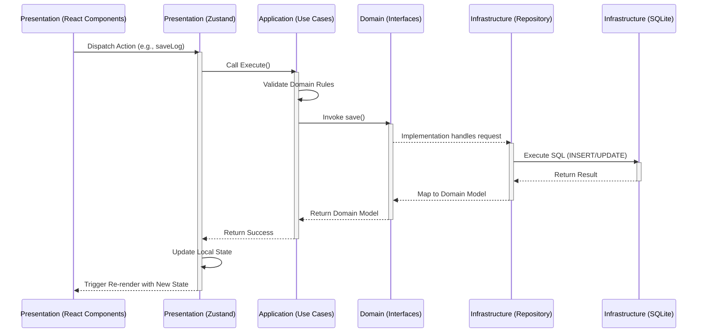

```mermaid
sequenceDiagram
    participant UI as Presentation (React Components)
    participant Store as Presentation (Zustand)
    participant UseCase as Application (Use Cases)
    participant RepoInterface as Domain (Interfaces)
    participant RepoImpl as Infrastructure (Repository)
    participant DB as Infrastructure (SQLite)

    UI->>Store: Dispatch Action (e.g., saveLog)
    activate Store
    Store->>UseCase: Call Execute()
    activate UseCase
    UseCase->>UseCase: Validate Domain Rules
    UseCase->>RepoInterface: Invoke save()
    activate RepoInterface
    RepoInterface-->>RepoImpl: Implementation handles request
    activate RepoImpl
    RepoImpl->>DB: Execute SQL (INSERT/UPDATE)
    activate DB
    DB-->>RepoImpl: Return Result
    deactivate DB
    RepoImpl-->>RepoInterface: Map to Domain Model
    deactivate RepoImpl
    RepoInterface-->>UseCase: Return Domain Model
    deactivate RepoInterface
    UseCase-->>Store: Return Success
    deactivate UseCase
    Store->>Store: Update Local State
    Store-->>UI: Trigger Re-render with New State
    deactivate Store
```
